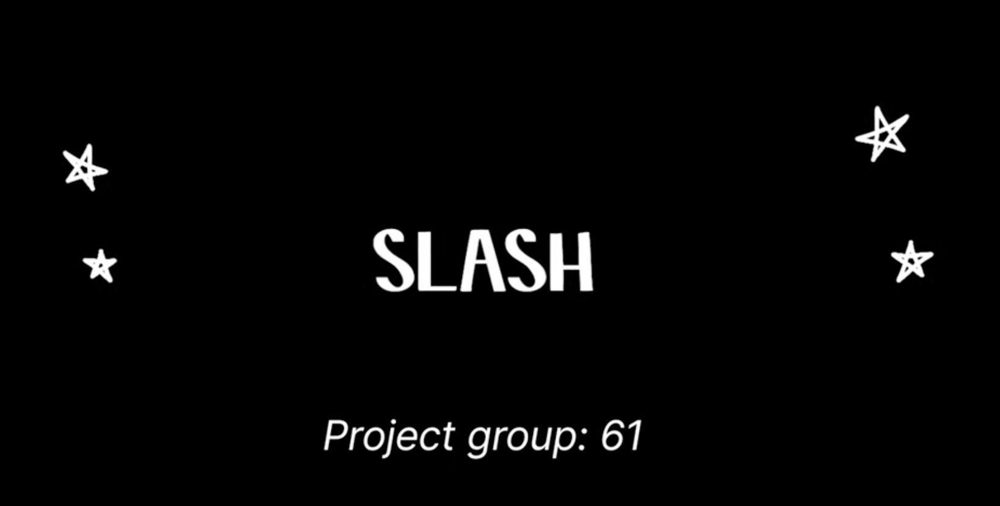

# Project 1 README

### Part 1 (easy): For five prior projects, score them according to the project2 rubic. 

#### Link to the gradings for each projects

- [C.E.L.T: The Sentimental Analyser](Project_grading_md/CSC%20510%20Assignment%201%20-%20Group%2061%20-%20SentAnalyzer.md) &#128279;
- [Jobby](Project_grading_md/CSC%20510%20Assignment%201%20-%20Group%2061%20-%20Jobby.md) &#128279;
- [GITS - Bhavesh](Project_grading_md/CSC%20510%20Assignment%201%20-%20Group%2061%20-%20GITS%20(Bhavesh).md) &#128279;
- [GITS - Harshit](Project_grading_md/CSC%20510%20Assignment%201%20-%20Group%2061%20-%20GITS%20(Harshit).md) &#128279;
- [Slash](Project_grading_md/CSC%20510%20Assignment%201%20-%20Group%2061%20-%20Slash.md) &#128279;

#### Link to the all the csv files of projects gradings

[CSV Files](Project_grading_csv) &#128279;

---

### Part 2 (hard): For one prior project, a 2 minute YouTube video (with a 2023 date) showing you can run that system

---

### Part 3 (important): Write 750 words in a mardown file describing what was hard about this process, how that pain could have been avoided and what practices you are committing to perform in project2 to avoid that pain.

[Group 61 - Essay in markdown file](Essay.md) &#128279;